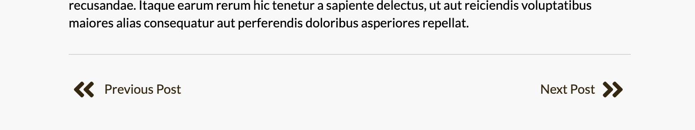
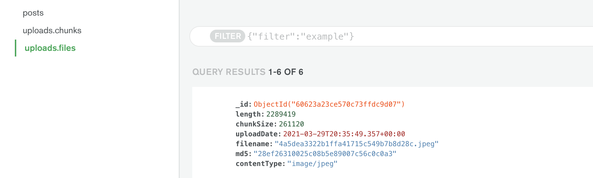
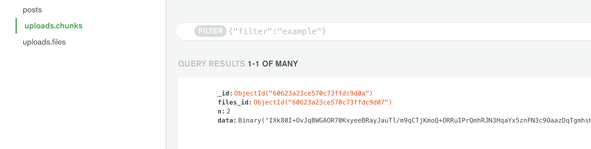

#Foodie Blog 🍽️ 

##[Live Demo](https://dry-anchorage-96447.herokuapp.com/)

## About Foodie
Foodie is a modern web application designed for sharing restaurant reviews with other foodies!

Foodie (n):
> a person with a particular interest in food; a gourmet.

#### Motivation
As a foodie myself, I created this application because I wanted to create my own food blog. However, rather than using third-party site to create and host my blog, I thought it would be a great learning opportunity for me to challenge myself and create my own React blog application!

## How to use

#### Homepage

The homepage summarizes and displays each review post in a feed. When clicked, you are taken to the post page where you may view the full review.

#### Easily browse through each review

The post page features a "Next Post" and a "Previous Post" button that allows you to easily  browse through each post.

#### Dashboard

To create, edit, and delete reviews, simply go to the Dashboard page.

Here, you may find the button to create a new post, as well as a list of already existing posts that you may edit or delete.

**Each review includes a...**

* title
* description
* location
* category
* rating system (aesthetic, vibes, flavor)
* text section to describe your experience
* photo upload

## Technologies Used
This is a **MERN Stack application** which is made up by four key technologies:

* [MongoDB](https://docs.mongodb.com/) - document base
* [express.js](https://expressjs.com/) - Node.js web framework
* [react.js](https://reactjs.org/) - a client-side JavaScript framework
* [node.js](https://nodejs.org/en/docs/) - an open source JavaScript web server/runtime

##### Other key technologies used include:

* [React Hooks](https://reactjs.org/docs/hooks-intro.html) - introduced in React 16.8, hooks let you use state and other features without having to use class based components
* [axios](https://www.npmjs.com/package/axios) - promise based HTTP client for browser and Node.js
* [react-router-dom](https://www.npmjs.com/package/react-router-dom) - DOM bindings for React Router ie) the router components for websites
* [semantic-ui-react](https://react.semantic-ui.com/) - official React integration for the Semantic UI CSS framework
* [multer](https://www.npmjs.com/package/multer) - node.js middleware for handling multipart/form-data, primarily for uploading files
* [multer-gridfs-storage](https://www.npmjs.com/package/multer-gridfs-storage) - GridFS storage engine for Multer to store uploaded files directly to MongoDB
* [mongoose](https://www.npmjs.com/package/mongoose) - MongoDB object modeling tool designed for asynchronous environments
* [morgan](https://www.npmjs.com/package/morgan) -  HTTP request logger middleware for node.js
* [react-quill](https://www.npmjs.com/package/react-quill) - text editor component for React
* [html-react-parser](https://www.npmjs.com/package/html-react-parser) - parses HTML to React (works both on the server and client)

## App Features
Foodie makes use of multer and GridFS storage, which stores files into MongoDB in a very interesting way.

Since MongoDB has a file size limit for BSON (binary image) data, a way to bypass that is by breaking up image files into chunks.

##### Image file data

##### Files broken up into chunks

## Project Setup
After cloning the repository to your machine...

Install dependencies in both client and server sides of the application:

`yarn install`

To start the development environment:

`yarn dev`

## Future Scope
1. In future versions, I want to implement **user log-in with open authentication**.
	* This would open up many possibilities such as having a page for each user, being able to view other user's posts, and setting reviews as private/public.
2. Implementing **post hashtags and a search bar** where you could search for posts with certain keywords would be a very cool feature to have as well.

## License
MIT © [Pauline Ann Bantayan](https://www.paulineann.me/)